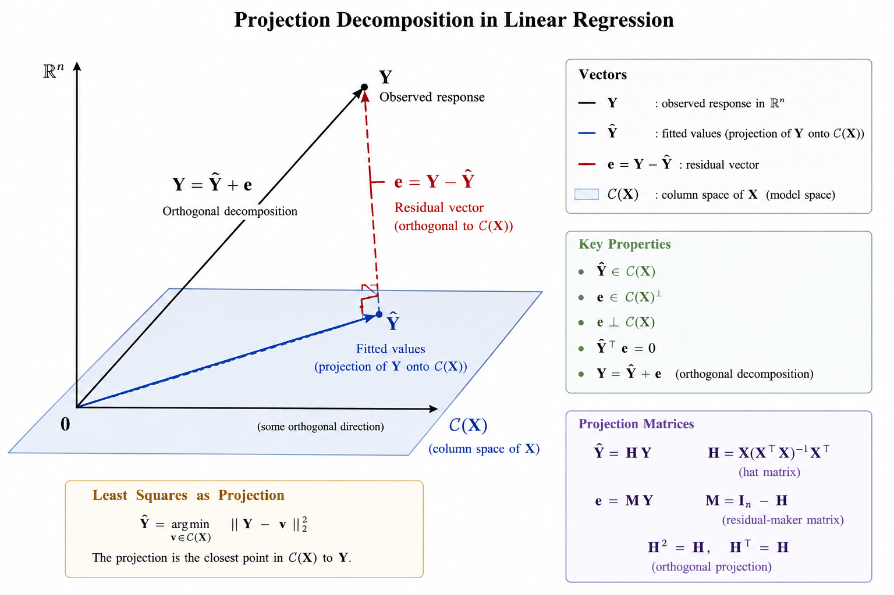

# Least Squares Estimation

In this chapter, we study one of the fundamental ideas in linear models:
**least squares estimation**.

Recall that the linear model is

$$
\mathbf{Y}
=
\mathbf{X}\boldsymbol{\beta}
+
\boldsymbol{\varepsilon}.
$$

The unknown parameter vector $\boldsymbol{\beta}$ determines the mean
structure of the response. Given observed data, our first goal is to
estimate $\boldsymbol{\beta}$.

The central idea of least squares is simple:

> Choose the value of $\boldsymbol{\beta}$ for which the fitted response
> $\mathbf{X}\boldsymbol{\beta}$ is as close as possible to the observed
> response $\mathbf{Y}$.

This optimization problem leads to the **normal equations**, the
**least squares estimator**, and a useful geometric interpretation in
terms of **orthogonal projection**.

> Learning Objectives
>
> By the end of this week, students should be able to:
>
> - formulate least squares estimation as an optimization problem;
> - define the residual sum of squares;
> - derive the normal equations;
> - obtain the least squares estimator when $\mathbf{X}$ has full column rank;
> - explain the role of the column space $\mathcal{C}(\mathbf{X})$;
> - interpret fitted values as an orthogonal projection;
> - explain why residuals are orthogonal to the model space;
> - define and interpret the hat matrix and residual-maker matrix;
> - verify symmetry and idempotence of projection matrices;
> - explain the decomposition
>   $\mathbf{Y}=\hat{\mathbf{Y}}+\mathbf{e}$;
> - distinguish the uniqueness of $\hat{\boldsymbol{\beta}}$ from the
>   uniqueness of the fitted values.

**Reading**

Recommended reading for this week:

- Seber and Lee:
  - Chapter 3: sections on least squares estimation
- Montgomery, Peck, and Vining:
  - introductory sections on estimation in linear regression


::: {.callout-note title="Recap of the Linear Model"}

Recall from [Week 1](01_matrix_representation.qmd), the linear model can
be written as

$$
\mathbf{Y}
=
\mathbf{X}\boldsymbol{\beta}
+
\boldsymbol{\varepsilon},
$$

where

- $\mathbf{Y}$ is an $n\times 1$ response vector;
- $\mathbf{X}$ is an $n\times p$ design matrix;
- $\boldsymbol{\beta}$ is a $p\times 1$ parameter vector;
- $\boldsymbol{\varepsilon}$ is an $n\times 1$ error vector.

The design matrix may be written as

$$
\mathbf{X}
=
\begin{pmatrix}
\mathbf{x}_1^\top\\
\mathbf{x}_2^\top\\
\vdots\\
\mathbf{x}_n^\top
\end{pmatrix},
$$

where $\mathbf{x}_i\in\mathbb{R}^p$ contains the predictors associated
with observation $i$.

Thus,

$$
Y_i
=
\mathbf{x}_i^\top\boldsymbol{\beta}
+
\varepsilon_i,
\qquad
i=1,\ldots,n.
$$

Under the classical linear model, we often assume

$$
\mathbb{E}(\boldsymbol{\varepsilon})
=
\mathbf{0},
\qquad
\operatorname{Var}(\boldsymbol{\varepsilon})
=
\sigma^2\mathbf{I}_n.
$$

Consequently,

$$
\mathbb{E}(\mathbf{Y})
=
\mathbf{X}\boldsymbol{\beta},
\qquad
\operatorname{Var}(\mathbf{Y})
=
\sigma^2\mathbf{I}_n.
$$

:::


{#fig-ls-projection width=95%}


::: {.callout-important title="Least Squares Does Not Require a Distributional Assumption"}

The least squares estimator is defined through the optimization problem

$$
\min_{\boldsymbol{\beta}}
\left\|
\mathbf{Y}-\mathbf{X}\boldsymbol{\beta}
\right\|_2^2.
$$

No distributional assumption on $\boldsymbol{\varepsilon}$ is required
to define or compute the least squares estimator.

Assumptions such as

$$
\mathbb{E}(\boldsymbol{\varepsilon})=\mathbf{0}
$$

and

$$
\operatorname{Var}(\boldsymbol{\varepsilon})
=
\sigma^2\mathbf{I}_n
$$

are needed when we study the **statistical properties** of the
estimator.

Normality will be introduced later when we study exact finite-sample
inference.

:::


## The Least Squares Criterion

**Motivation**

For any candidate value $\boldsymbol{\beta}$, the corresponding fitted
vector is

$$
\mathbf{X}\boldsymbol{\beta}.
$$

The discrepancy between the observed response $\mathbf{Y}$ and this
candidate fit is

$$
\mathbf{Y}-\mathbf{X}\boldsymbol{\beta}.
$$

A natural idea is to choose $\boldsymbol{\beta}$ so that this
discrepancy is as small as possible.

To measure its size, we use the squared Euclidean norm.


**Residual Sum of Squares**

The **residual sum of squares** associated with a candidate
$\boldsymbol{\beta}$ is

$$
S(\boldsymbol{\beta})
=
\left\|
\mathbf{Y}-\mathbf{X}\boldsymbol{\beta}
\right\|_2^2.
$$

Equivalently,

$$
S(\boldsymbol{\beta})
=
(\mathbf{Y}-\mathbf{X}\boldsymbol{\beta})^\top
(\mathbf{Y}-\mathbf{X}\boldsymbol{\beta}).
$$

In scalar notation,

$$
S(\boldsymbol{\beta})
=
\sum_{i=1}^n
\left(
Y_i-\mathbf{x}_i^\top\boldsymbol{\beta}
\right)^2.
$$

This last expression explains the name **least squares**: we choose
$\boldsymbol{\beta}$ to make the sum of the squared discrepancies as
small as possible.

We therefore define

$$
\hat{\boldsymbol{\beta}}
=
\arg\min_{\boldsymbol{\beta}\in\mathbb{R}^p}
S(\boldsymbol{\beta}).
$$

::: {#def-LSE}

## Least Squares Estimator

A **least squares estimator** is any value
$\hat{\boldsymbol{\beta}}$ satisfying

$$
S(\hat{\boldsymbol{\beta}})
\leq
S(\boldsymbol{\beta})
$$

for every $\boldsymbol{\beta}\in\mathbb{R}^p$.

:::

::: {#exm-lse-simple}

## LSE for Simple Linear Regression

Consider the simple linear regression model

$$
Y_i = \beta_0 + \beta_1 x_i + \varepsilon_i,
\qquad i=1,\ldots,n,
$$

where

$$
\mathbb{E}[\varepsilon_i]=0,
\qquad
\operatorname{Var}(\varepsilon_i)=\sigma^2.
$$

The fitted value at $x_i$ is

$$
\hat{Y}_i
=
\beta_0+\beta_1 x_i.
$$

The corresponding residual is

$$
e_i
=
Y_i-\beta_0-\beta_1x_i.
$$

The least squares method chooses $\beta_0$ and $\beta_1$ to minimize the **sum of squared residuals**

$$
S(\beta_0,\beta_1)
=
\sum_{i=1}^n
\left(
Y_i-\beta_0-\beta_1x_i
\right)^2.
$$

**Derivation of the Normal Equations**

To minimize $S(\beta_0,\beta_1)$, differentiate with respect to $\beta_0$ and $\beta_1$.

For $\beta_0$,

$$
\frac{\partial S}{\partial\beta_0}
=
-2
\sum_{i=1}^n
\left(
Y_i-\beta_0-\beta_1x_i
\right).
$$

Setting this equal to zero gives

$$
\sum_{i=1}^n
\left(
Y_i-\hat{\beta}_0-\hat{\beta}_1x_i
\right)
=
0.
$$

Therefore,

$$
\sum_{i=1}^nY_i
=
n\hat{\beta}_0
+
\hat{\beta}_1\sum_{i=1}^nx_i.
$$

Dividing by $n$,

$$
\bar{Y}
=
\hat{\beta}_0
+
\hat{\beta}_1\bar{x},
$$

so

$$
\boxed{
\hat{\beta}_0
=
\bar{Y}
-
\hat{\beta}_1\bar{x}
}.
$$

For $\beta_1$,

$$
\frac{\partial S}{\partial\beta_1}
=
-2
\sum_{i=1}^n
x_i
\left(
Y_i-\beta_0-\beta_1x_i
\right).
$$

Setting this equal to zero gives

$$
\sum_{i=1}^n
x_i
\left(
Y_i-\hat{\beta}_0-\hat{\beta}_1x_i
\right)
=
0.
$$

Hence,

$$
\sum_{i=1}^n x_iY_i
=
\hat{\beta}_0\sum_{i=1}^nx_i
+
\hat{\beta}_1\sum_{i=1}^nx_i^2.
$$

Substituting

$$
\hat{\beta}_0
=
\bar{Y}-\hat{\beta}_1\bar{x},
$$

we obtain

$$
\sum_{i=1}^n x_iY_i
=
\left(
\bar{Y}-\hat{\beta}_1\bar{x}
\right)
\sum_{i=1}^nx_i
+
\hat{\beta}_1\sum_{i=1}^nx_i^2.
$$

Since

$$
\sum_{i=1}^n x_i
=
n\bar{x},
$$

we have

$$
\sum_{i=1}^n x_iY_i
-
n\bar{x}\bar{Y}
=
\hat{\beta}_1
\left(
\sum_{i=1}^nx_i^2
-
n\bar{x}^2
\right).
$$

Using

$$
\sum_{i=1}^n
(x_i-\bar{x})(Y_i-\bar{Y})
=
\sum_{i=1}^nx_iY_i
-
n\bar{x}\bar{Y},
$$

and

$$
\sum_{i=1}^n
(x_i-\bar{x})^2
=
\sum_{i=1}^nx_i^2
-
n\bar{x}^2,
$$

we obtain

$$
\boxed{
\hat{\beta}_1
=
\frac{
\sum_{i=1}^n
(x_i-\bar{x})(Y_i-\bar{Y})
}{
\sum_{i=1}^n
(x_i-\bar{x})^2
}
}.
$$

Therefore,

$$
\boxed{
\hat{\beta}_0
=
\bar{Y}
-
\hat{\beta}_1\bar{x}
}.
$$

**Alternative Notation**

It is common to define

$$
S_{xx}
=
\sum_{i=1}^n
(x_i-\bar{x})^2
$$

and

$$
S_{xy}
=
\sum_{i=1}^n
(x_i-\bar{x})(Y_i-\bar{Y}).
$$

Then

$$
\boxed{
\hat{\beta}_1
=
\frac{S_{xy}}{S_{xx}}
}
$$

and

$$
\boxed{
\hat{\beta}_0
=
\bar{Y}
-
\frac{S_{xy}}{S_{xx}}\bar{x}
}.
$$

Thus, the fitted regression line is

$$
\boxed{
\hat{Y}_i
=
\hat{\beta}_0
+
\hat{\beta}_1x_i
}.
$$

:::

## Derivation of the Least Squares Estimator in a matrix form

**Expansion of the Criterion**
Starting from

$$
S(\boldsymbol{\beta})
=
(\mathbf{Y}-\mathbf{X}\boldsymbol{\beta})^\top
(\mathbf{Y}-\mathbf{X}\boldsymbol{\beta}),
$$

we expand:

\begin{align*}
S(\boldsymbol{\beta})
&=
\mathbf{Y}^\top\mathbf{Y}
-
\mathbf{Y}^\top\mathbf{X}\boldsymbol{\beta}
-
\boldsymbol{\beta}^\top\mathbf{X}^\top\mathbf{Y}
+
\boldsymbol{\beta}^\top
\mathbf{X}^\top\mathbf{X}
\boldsymbol{\beta}.
\end{align*}

Because

$$
\mathbf{Y}^\top\mathbf{X}\boldsymbol{\beta}
$$

is a scalar,

$$
\mathbf{Y}^\top\mathbf{X}\boldsymbol{\beta}
=
\boldsymbol{\beta}^\top\mathbf{X}^\top\mathbf{Y}.
$$

Therefore,

$$
\boxed{
S(\boldsymbol{\beta})
=
\mathbf{Y}^\top\mathbf{Y}
-
2\boldsymbol{\beta}^\top
\mathbf{X}^\top\mathbf{Y}
+
\boldsymbol{\beta}^\top
\mathbf{X}^\top\mathbf{X}
\boldsymbol{\beta}.
}
$$


**Derivation of the Normal Equations**

Differentiate $S(\boldsymbol{\beta})$ with respect to
$\boldsymbol{\beta}$:

$$
\frac{\partial S(\boldsymbol{\beta})}
{\partial\boldsymbol{\beta}}
=
-2\mathbf{X}^\top\mathbf{Y}
+
2\mathbf{X}^\top\mathbf{X}\boldsymbol{\beta}.
$$

At a minimum, the gradient is zero, so

$$
-2\mathbf{X}^\top\mathbf{Y}
+
2\mathbf{X}^\top
\mathbf{X}\hat{\boldsymbol{\beta}}
=
\mathbf{0}.
$$

Thus,

$$
\boxed{
\mathbf{X}^\top\mathbf{X}
\hat{\boldsymbol{\beta}}
=
\mathbf{X}^\top\mathbf{Y}.
}
$$

These are called the **normal equations**.


::: {.callout-note title="Why Are They Called the Normal Equations?"}

The normal equations can be written as

$$
\mathbf{X}^\top
\left(
\mathbf{Y}
-
\mathbf{X}\hat{\boldsymbol{\beta}}
\right)
=
\mathbf{0}.
$$

Later we will define

$$
\mathbf{e}
=
\mathbf{Y}
-
\mathbf{X}\hat{\boldsymbol{\beta}}.
$$

Therefore,

$$
\mathbf{X}^\top\mathbf{e}
=
\mathbf{0}.
$$

This means that $\mathbf{e}$ is perpendicular, or **normal**, to the
column space of $\mathbf{X}$.

Thus, the word *normal* is being used in its geometric sense.

:::


**Why is the Stationary Point a Minimum?**

The Hessian of the least squares criterion is

$$
\nabla^2 S(\boldsymbol{\beta})
=
2\mathbf{X}^\top\mathbf{X}.
$$

For any $\mathbf{a}\in\mathbb{R}^p$,

$$
\mathbf{a}^\top
\mathbf{X}^\top\mathbf{X}
\mathbf{a}
=
(\mathbf{X}\mathbf{a})^\top
(\mathbf{X}\mathbf{a})
=
\|\mathbf{X}\mathbf{a}\|_2^2
\geq 0.
$$

Therefore, $\mathbf{X}^\top\mathbf{X}$ is positive semidefinite, and
$S(\boldsymbol{\beta})$ is a convex function.

If $\mathbf{X}$ has full column rank, then for every
$\mathbf{a}\neq\mathbf{0}$,

$$
\mathbf{X}\mathbf{a}\neq\mathbf{0},
$$

and hence

$$
\mathbf{a}^\top
\mathbf{X}^\top\mathbf{X}
\mathbf{a}
>
0.
$$

Thus, $\mathbf{X}^\top\mathbf{X}$ is positive definite and the least
squares minimizer is unique.


::: {.callout-theorem title="Least Squares Estimator"}

A vector $\hat{\boldsymbol{\beta}}$ minimizes

$$
S(\boldsymbol{\beta})
=
\left\|
\mathbf{Y}
-
\mathbf{X}\boldsymbol{\beta}
\right\|_2^2
$$

if and only if it satisfies the normal equations

$$
\mathbf{X}^\top\mathbf{X}
\hat{\boldsymbol{\beta}}
=
\mathbf{X}^\top\mathbf{Y}.
$$

If $\mathbf{X}$ has full column rank,

$$
\operatorname{rank}(\mathbf{X})=p,
$$

then $\mathbf{X}^\top\mathbf{X}$ is invertible and the least squares
estimator is unique:

$$
\boxed{
\hat{\boldsymbol{\beta}}
=
(\mathbf{X}^\top\mathbf{X})^{-1}
\mathbf{X}^\top\mathbf{Y}.
}
$$

This is commonly called the **ordinary least squares estimator**, or
**OLS estimator**.

:::


::: {.callout-note title="When Is the Closed-Form Formula Valid?"}

The expression

$$
(\mathbf{X}^\top\mathbf{X})^{-1}
$$

exists if and only if $\mathbf{X}$ has full column rank:

$$
\operatorname{rank}(\mathbf{X})=p.
$$

This means that the columns of $\mathbf{X}$ are linearly independent.

If they are linearly dependent, then
$\mathbf{X}^\top\mathbf{X}$ is singular and the inverse does not exist.

We will return to this issue later.

:::


::: {#exm-simple-linear-regression}

## LSE for Simple Linear Regression continue

As shown in @exm-lse-simple, we know the expression of the LSE $\hat{\mathbf{\beta}}$. Here, we want to see its connection to the matrix Form.

For simple linear regression,

$$
\mathbf{Y}
=
\begin{pmatrix}
Y_1\\
Y_2\\
\vdots\\
Y_n
\end{pmatrix},
\qquad
\mathbf{X}
=
\begin{pmatrix}
1 & x_1\\
1 & x_2\\
\vdots & \vdots\\
1 & x_n
\end{pmatrix},
\qquad
\boldsymbol{\beta}
=
\begin{pmatrix}
\beta_0\\
\beta_1
\end{pmatrix}.
$$

The general least squares estimator is

$$
\hat{\boldsymbol{\beta}}
=
(\mathbf{X}^\top\mathbf{X})^{-1}
\mathbf{X}^\top\mathbf{Y}.
$$

For simple linear regression,

$$
\mathbf{X}^\top\mathbf{X}
=
\begin{pmatrix}
n & \sum_{i=1}^n x_i\\
\sum_{i=1}^n x_i & \sum_{i=1}^n x_i^2
\end{pmatrix},
$$

and

$$
\mathbf{X}^\top\mathbf{Y}
=
\begin{pmatrix}
\sum_{i=1}^nY_i\\
\sum_{i=1}^nx_iY_i
\end{pmatrix}.
$$

Therefore,

$$
\hat{\boldsymbol{\beta}}
=
\begin{pmatrix}
\hat{\beta}_0\\
\hat{\beta}_1
\end{pmatrix}
=
(\mathbf{X}^\top\mathbf{X})^{-1}
\mathbf{X}^\top\mathbf{Y},
$$

which gives exactly

$$
\boxed{
\hat{\beta}_1
=
\frac{
\sum_{i=1}^n(x_i-\bar{x})(Y_i-\bar{Y})
}{
\sum_{i=1}^n(x_i-\bar{x})^2
}
}
$$

and

$$
\boxed{
\hat{\beta}_0
=
\bar{Y}-\hat{\beta}_1\bar{x}
}.
$$

:::

Hence, 

>
> The familiar simple linear regression formulas for
> $\hat{\beta}_0$ and $\hat{\beta}_1$ are special cases of the general matrix LSE
>
> $$
> \hat{\boldsymbol{\beta}}
> =
> (\mathbf{X}^\top\mathbf{X})^{-1}
> \mathbf{X}^\top\mathbf{Y}.
> $$


## Geometric Interpretation of Least Squares

The algebraic derivation gives us the estimator. However, the geometry
explains **why** least squares has its important properties.


::: {.callout-note title="Recap: Column Space of the Design Matrix"}

The column space of $\mathbf{X}$ is

$$
\mathcal{C}(\mathbf{X})
=
\left\{
\mathbf{X}\boldsymbol{\beta}
:
\boldsymbol{\beta}\in\mathbb{R}^p
\right\}.
$$

Thus, $\mathcal{C}(\mathbf{X})$ is the set of all response vectors that
can be represented exactly by the linear model.

If $\mathbf{X}$ has full column rank $p$, then

$$
\dim\left\{\mathcal{C}(\mathbf{X})\right\}=p.
$$

Because $\mathbf{X}$ has $n$ rows,

$$
\mathcal{C}(\mathbf{X})
\subseteq
\mathbb{R}^n.
$$

:::


### Least Squares as Projection

The fitted value vector is

$$
\hat{\mathbf{Y}}
=
\mathbf{X}\hat{\boldsymbol{\beta}}.
$$

Because

$$
\hat{\mathbf{Y}}
\in
\mathcal{C}(\mathbf{X}),
$$

least squares chooses the vector in
$\mathcal{C}(\mathbf{X})$ that is closest to the observed vector
$\mathbf{Y}$.

That is,

$$
\hat{\mathbf{Y}}
=
\arg\min_{\mathbf{v}\in\mathcal{C}(\mathbf{X})}
\|\mathbf{Y}-\mathbf{v}\|_2^2.
$$

Therefore, $\hat{\mathbf{Y}}$ is the **orthogonal projection** of
$\mathbf{Y}$ onto $\mathcal{C}(\mathbf{X})$.


> So we can say that the fitted vector $\hat{\mathbf{Y}}$ is constrained to live in the model space generated by the predictors. Least squares finds the point in that space closest to the observed data vector $\mathbf{Y}$.

::: {#def-orthogonality}

## Orthogonality

Two vectors $\mathbf{u},\mathbf{v}\in\mathbb{R}^n$ are said to be **orthogonal** if their inner product is zero:

$$
\mathbf{u}^\top\mathbf{v}=0.
$$

We write

$$
\mathbf{u}\perp\mathbf{v}.
$$

Geometrically, two nonzero vectors are orthogonal if the angle between them is $90^\circ$.

:::

::: {#def-residual-vector}

## Residual Vector

After obtaining the least squares estimator, define the **residual
vector**

$$
\boxed{
\mathbf{e}
=
\mathbf{Y}
-
\hat{\mathbf{Y}}
=
\mathbf{Y}
-
\mathbf{X}\hat{\boldsymbol{\beta}}.
}
$$

The individual residuals are

$$
e_i
=
Y_i-\hat{Y}_i,
\qquad
i=1,\ldots,n.
$$

Geometrically, $\mathbf{e}$ is the component of $\mathbf{Y}$ that is
orthogonal to the model space $\mathcal{C}(\mathbf{X})$.

:::

::: {#prp-orthogonality-of-residuals}

## Orthogonality of the Residuals

Recall that the least squares estimator satisfies the normal equations

$$
\mathbf{X}^\top\mathbf{X}\hat{\boldsymbol{\beta}}
=
\mathbf{X}^\top\mathbf{Y}.
$$

Rearranging,

$$
\mathbf{X}^\top
\left(
\mathbf{Y}
-
\mathbf{X}\hat{\boldsymbol{\beta}}
\right)
=
\mathbf{0}.
$$

Since the residual vector is

$$
\mathbf{e}
=
\mathbf{Y}
-
\hat{\mathbf{Y}}
=
\mathbf{Y}
-
\mathbf{X}\hat{\boldsymbol{\beta}},
$$

we obtain the fundamental least squares property

$$
\boxed{
\mathbf{X}^\top\mathbf{e}
=
\mathbf{0}.
}
$$

To understand what this means, write the design matrix as

$$
\mathbf{X}
=
\begin{pmatrix}
\mathbf{x}^{(1)}
&
\mathbf{x}^{(2)}
&
\cdots
&
\mathbf{x}^{(p)}
\end{pmatrix},
$$

where $\mathbf{x}^{(j)}$ is the $j$th column of $\mathbf{X}$.

Then

$$
\mathbf{X}^\top\mathbf{e}
=
\begin{pmatrix}
(\mathbf{x}^{(1)})^\top\mathbf{e}\\
(\mathbf{x}^{(2)})^\top\mathbf{e}\\
\vdots\\
(\mathbf{x}^{(p)})^\top\mathbf{e}
\end{pmatrix}
=
\mathbf{0}.
$$

Therefore,

$$
(\mathbf{x}^{(j)})^\top\mathbf{e}
=
0,
\qquad
j=1,\ldots,p.
$$

Thus, the residual vector is orthogonal to every column of $\mathbf{X}$.

Because the column space $\mathcal{C}(\mathbf{X})$ consists of all linear combinations of the columns of $\mathbf{X}$, it follows that

$$
\boxed{
\mathbf{e}
\perp
\mathcal{C}(\mathbf{X}).
}
$$

**Intuition.** The columns of $\mathbf{X}$ represent all directions that the linear model is allowed to use. After least squares has chosen the best fitted value, the remaining error $\mathbf{e}$ has no component left in any of these directions. Otherwise, we could move the fitted value within $\mathcal{C}(\mathbf{X})$ and reduce the residual sum of squares further.

:::


::: {#prp-fundamental-orthogonal-decomposition}

## Fundamental Orthogonal Decomposition

The fitted response vector is

$$
\hat{\mathbf{Y}}
=
\mathbf{X}\hat{\boldsymbol{\beta}}.
$$

Therefore,

$$
\boxed{
\hat{\mathbf{Y}}
\in
\mathcal{C}(\mathbf{X}).
}
$$

In other words, $\hat{\mathbf{Y}}$ must lie in the space generated by the columns of $\mathbf{X}$.

Since

$$
\mathbf{e}
=
\mathbf{Y}
-
\hat{\mathbf{Y}},
$$

we can write

$$
\boxed{
\mathbf{Y}
=
\hat{\mathbf{Y}}
+
\mathbf{e}.
}
$$

The two components satisfy

$$
\hat{\mathbf{Y}}
\in
\mathcal{C}(\mathbf{X})
$$

and

$$
\mathbf{e}
\in
\mathcal{C}(\mathbf{X})^\perp.
$$

Hence,

$$
\boxed{
\hat{\mathbf{Y}}^\top\mathbf{e}
=
0.
}
$$

Geometrically, least squares projects $\mathbf{Y}$ onto the column space of $\mathbf{X}$:

$$
\mathbf{Y}
=
\underbrace{\hat{\mathbf{Y}}}_{\text{part explained by the model}}
+
\underbrace{\mathbf{e}}_{\text{part orthogonal to the model space}}.
$$

Because the two components are orthogonal, the Pythagorean theorem gives

$$
\boxed{
\|\mathbf{Y}\|^2
=
\|\hat{\mathbf{Y}}\|^2
+
\|\mathbf{e}\|^2.
}
$$

This geometric decomposition is the foundation of least squares regression and will later lead naturally to the decomposition of sums of squares in ANOVA.

:::

::: {#exr-calculation}

## Computational Problems

Let

$$
\mathbf{X}
=
\begin{pmatrix}
1 & 0\\
1 & 1\\
1 & 2
\end{pmatrix},
\qquad
\mathbf{Y}
=
\begin{pmatrix}
1\\
2\\
2
\end{pmatrix}.
$$

1. Compute $\mathbf{X}^\top\mathbf{X}.$

2. Compute $\mathbf{X}^\top\mathbf{Y}.$

3. Find $\hat{\boldsymbol{\beta}}.$

4. Compute $\hat{\mathbf{Y}}.$

5. Compute the residual vector $\mathbf{e}.$

6. Verify that $\mathbf{X}^\top\mathbf{e} = \mathbf{0}.$

:::


::: {#sol-calculation}

## Solution for @exr-calculation

**Hand calculation**

We have

$$
\mathbf{X}^\top\mathbf{X}
=
\begin{pmatrix}
3 & 3\\
3 & 5
\end{pmatrix}.
$$

Also,

$$
\mathbf{X}^\top\mathbf{Y}
=
\begin{pmatrix}
5\\
6
\end{pmatrix}.
$$

Therefore,

$$
\hat{\boldsymbol{\beta}}
=
(\mathbf{X}^\top\mathbf{X})^{-1}
\mathbf{X}^\top\mathbf{Y}
=
\begin{pmatrix}
7/6\\
1/2
\end{pmatrix}.
$$

The fitted values are

$$
\hat{\mathbf{Y}}
=
\mathbf{X}\hat{\boldsymbol{\beta}}
=
\begin{pmatrix}
7/6\\
5/3\\
13/6
\end{pmatrix}.
$$

Thus, the residual vector is

$$
\mathbf{e}
=
\mathbf{Y}
-
\hat{\mathbf{Y}}
=
\begin{pmatrix}
-1/6\\
1/3\\
-1/6
\end{pmatrix}.
$$

**R calculation**

```{r}
# Define X and Y
X <- matrix(
  c(
    1, 0,
    1, 1,
    1, 2
  ),
  nrow = 3,
  byrow = TRUE
)

Y <- matrix(
  c(1, 2, 2),
  ncol = 1
)

# 1. Compute X'X
XtX <- t(X) %*% X
XtX

# 2. Compute X'Y
XtY <- t(X) %*% Y
XtY

# 3. Compute beta_hat
beta_hat <- solve(XtX) %*% XtY
beta_hat

# 4. Compute fitted values
Y_hat <- X %*% beta_hat
Y_hat

# 5. Compute residuals
e <- Y - Y_hat
e

# Optional checks
t(X) %*% e
t(Y_hat) %*% e
```

:::

::: {#exr-column-space}

Explain in words what the column space

   $$
   \mathcal{C}(\mathbf{X})
   $$

   represents in a linear regression model.

:::

::: {#sol-column-space}

The column space of $\mathbf{X}$ is the set of all response patterns that can be represented by the linear model.

More intuitively, 
  
$\mathcal{C}(\mathbf{X})$ describes everything the model is capable of fitting. Anything outside this space cannot be explained by the predictors in $\mathbf{X}$.

:::

### Consequence when an Intercept Is Included

If the model includes an intercept, then one column of $\mathbf{X}$ is

$$
\mathbf{1}_n
=
\begin{pmatrix}
1\\
1\\
\vdots\\
1
\end{pmatrix}.
$$

Since the residual vector is orthogonal to every column of
$\mathbf{X}$,

$$
\mathbf{1}_n^\top\mathbf{e}
=
0.
$$

Therefore,

$$
\boxed{
\sum_{i=1}^n e_i
=
0.
}
$$

Since

$$
e_i
=
Y_i-\hat{Y}_i,
$$

we also have

$$
\sum_{i=1}^n Y_i
=
\sum_{i=1}^n \hat{Y}_i.
$$

Thus,

$$
\boxed{
\bar{\hat{Y}}
=
\bar{Y}.
}
$$

::: {.callout-note title="Intuition for the Mean of the Fitted Values"}

The intercept allows the fitted model to shift up or
down. At the least squares solution, there can be no overall tendency
for the fitted values to be systematically too high or too low.
Therefore, the residuals sum to zero and the fitted values have the
same mean as the observed responses.

:::

## The Hat Matrix

In the full-column-rank case,

$$
\hat{\mathbf{Y}}
=
\mathbf{X}\hat{\boldsymbol{\beta}}.
$$

Substituting

$$
\hat{\boldsymbol{\beta}}
=
(\mathbf{X}^\top\mathbf{X})^{-1}
\mathbf{X}^\top\mathbf{Y},
$$

we obtain

$$
\hat{\mathbf{Y}}
=
\mathbf{X}
(\mathbf{X}^\top\mathbf{X})^{-1}
\mathbf{X}^\top
\mathbf{Y}.
$$


::: {.callout-definition title="The Hat Matrix"}

Define

$$
\boxed{
\mathbf{H}
=
\mathbf{X}
(\mathbf{X}^\top\mathbf{X})^{-1}
\mathbf{X}^\top.
}
$$

Then

$$
\boxed{
\hat{\mathbf{Y}}
=
\mathbf{H}\mathbf{Y}.
}
$$

The matrix $\mathbf{H}$ is called the **hat matrix** because it puts the
"hat" on $\mathbf{Y}$:

$$
\mathbf{Y}
\quad \longrightarrow \quad
\mathbf{H}\mathbf{Y}
=
\hat{\mathbf{Y}}.
$$

:::


### Properties of the Hat Matrix

::: {.callout-property title="Properties of the Hat Matrix"}

When $\mathbf{X}$ has full column rank, the hat matrix satisfies:

**i) Symmetry**

$$
\boxed{
\mathbf{H}^\top
=
\mathbf{H}.
}
$$

**ii) Idempotence**

$$
\boxed{
\mathbf{H}^2
=
\mathbf{H}.
}
$$

**iii) Projection of the design matrix**

$$
\boxed{
\mathbf{H}\mathbf{X}
=
\mathbf{X}.
}
$$

**iv) Rank**

$$
\boxed{
\operatorname{rank}(\mathbf{H})
=
p.
}
$$

**v) Trace**

$$
\boxed{
\operatorname{tr}(\mathbf{H})
=
p.
}
$$

A symmetric and idempotent matrix represents an orthogonal projection.

Therefore, $\mathbf{H}$ is the orthogonal projection matrix onto

$$
\mathcal{C}(\mathbf{X}).
$$

:::


::: {.callout-note title = "Why it is symmetric"}

We have

\begin{align*}
\mathbf{H}^\top
&=
\left[
\mathbf{X}
(\mathbf{X}^\top\mathbf{X})^{-1}
\mathbf{X}^\top
\right]^\top\\
&=
\mathbf{X}
\left[
(\mathbf{X}^\top\mathbf{X})^{-1}
\right]^\top
\mathbf{X}^\top.
\end{align*}

Since $\mathbf{X}^\top\mathbf{X}$ is symmetric, its inverse is also
symmetric. Therefore,

$$
\mathbf{H}^\top
=
\mathbf{H}.
$$
:::

::: {.callout-note title = "Why it is idempotent"}

We have

\begin{align*}
\mathbf{H}^2
&=
\mathbf{X}
(\mathbf{X}^\top\mathbf{X})^{-1}
\mathbf{X}^\top
\mathbf{X}
(\mathbf{X}^\top\mathbf{X})^{-1}
\mathbf{X}^\top\\
&=
\mathbf{X}
(\mathbf{X}^\top\mathbf{X})^{-1}
\mathbf{X}^\top\\
&=
\mathbf{H}.
\end{align*}

Thus,

$$
\mathbf{H}^2=\mathbf{H}.
$$

:::

::: {.callout-note title="What Does Idempotence Mean Geometrically?"}

If we project $\mathbf{Y}$ onto $\mathcal{C}(\mathbf{X})$ once, we obtain

$$
\hat{\mathbf{Y}}
=
\mathbf{H}\mathbf{Y}.
$$

Projecting the fitted vector again does nothing:

$$
\mathbf{H}\hat{\mathbf{Y}}
=
\mathbf{H}^2\mathbf{Y}
=
\mathbf{H}\mathbf{Y}
=
\hat{\mathbf{Y}}.
$$

Once a vector is already inside the model space, projecting it onto the
same space leaves it unchanged.

:::


Notice that, $\mathbf{e} =\mathbf{Y}-\hat{\mathbf{Y}}$ and $\hat{\mathbf{Y}}=\mathbf{H}\mathbf{Y},$ we have

$$
\mathbf{e}
=
(\mathbf{I}_n-\mathbf{H})\mathbf{Y}.
$$


::: {#def-residual-maker-matrix}

## Residual-Maker Matrix

Define

$$
\boxed{
\mathbf{M}
=
\mathbf{I}_n-\mathbf{H}.
}
$$

Then

$$
\boxed{
\mathbf{e}
=
\mathbf{M}\mathbf{Y}.
}
$$

The matrix $\mathbf{M}$ is called the **residual-maker matrix**.

It removes the component of $\mathbf{Y}$ lying in
$\mathcal{C}(\mathbf{X})$.

:::


::: {#prp-properties-of-residual-maker-matrix}

## Properties of the Residual-Maker Matrix

Since

$$
\mathbf{M}
=
\mathbf{I}_n-\mathbf{H},
$$

we obtain

$$
\mathbf{M}^\top
=
\mathbf{M}
$$

and

$$
\mathbf{M}^2
=
\mathbf{M}.
$$

Thus, $\mathbf{M}$ is also an orthogonal projection matrix.

While $\mathbf{H}$ projects onto

$$
\mathcal{C}(\mathbf{X}),
$$

$\mathbf{M}$ projects onto

$$
\mathcal{C}(\mathbf{X})^\perp.
$$

In addition,

$$
\boxed{
\mathbf{H}\mathbf{M}
=
\mathbf{M}\mathbf{H}
=
\mathbf{0}.
}
$$

Under full column rank,

$$
\operatorname{rank}(\mathbf{M})
=
n-p
$$

and

$$
\operatorname{tr}(\mathbf{M})
=
n-p.
$$

:::

::: {.callout-note title="Two Complementary Projection Matrices"}

The matrices $\mathbf{H}$ and $\mathbf{M}$ split
$\mathbb{R}^n$ into two orthogonal components:

$$
\mathbb{R}^n
=
\mathcal{C}(\mathbf{X})
\oplus
\mathcal{C}(\mathbf{X})^\perp.
$$

For the observed response,

$$
\mathbf{Y}
=
\underbrace{\mathbf{H}\mathbf{Y}}_{\hat{\mathbf{Y}}}
+
\underbrace{\mathbf{M}\mathbf{Y}}_{\mathbf{e}}.
$$

Thus,

$$
\boxed{
\mathbf{H}+\mathbf{M}
=
\mathbf{I}_n.
}
$$

:::


## Sum of Squares Decomposition

### Uncentered Geometric Decomposition

Since

$$
\mathbf{Y}
=
\hat{\mathbf{Y}}
+
\mathbf{e}
$$

and

$$
\hat{\mathbf{Y}}^\top\mathbf{e}
=
0,
$$

we have

\begin{align*}
\mathbf{Y}^\top\mathbf{Y}
&=
(\hat{\mathbf{Y}}+\mathbf{e})^\top
(\hat{\mathbf{Y}}+\mathbf{e})\\
&=
\hat{\mathbf{Y}}^\top\hat{\mathbf{Y}}
+
2\hat{\mathbf{Y}}^\top\mathbf{e}
+
\mathbf{e}^\top\mathbf{e}\\
&=
\hat{\mathbf{Y}}^\top\hat{\mathbf{Y}}
+
\mathbf{e}^\top\mathbf{e}.
\end{align*}

Therefore,

$$
\boxed{
\|\mathbf{Y}\|_2^2
=
\|\hat{\mathbf{Y}}\|_2^2
+
\|\mathbf{e}\|_2^2.
}
$$

This is a direct application of the Pythagorean theorem.


### Centered Sum of Squares Decomposition

When the regression model contains an intercept,

$$
\bar{\hat{Y}}
=
\bar{Y}.
$$

Therefore,

$$
Y_i-\bar{Y}
=
(\hat{Y}_i-\bar{Y})
+
(Y_i-\hat{Y}_i).
$$

The two components are orthogonal, giving

$$
\boxed{
\sum_{i=1}^n
(Y_i-\bar{Y})^2
=
\sum_{i=1}^n
(\hat{Y}_i-\bar{Y})^2
+
\sum_{i=1}^n
(Y_i-\hat{Y}_i)^2.
}
$$

These quantities will later be called

- **total sum of squares**
  $$
  \mathrm{SST}
  =
  \sum_{i=1}^n(Y_i-\bar{Y})^2;
  $$

- **regression sum of squares**
  $$
  \mathrm{SSR}
  =
  \sum_{i=1}^n(\hat{Y}_i-\bar{Y})^2;
  $$

- **error sum of squares**
  $$
  \mathrm{SSE}
  =
  \sum_{i=1}^n(Y_i-\hat{Y}_i)^2.
  $$

Thus,

$$
\boxed{
\mathrm{SST}
=
\mathrm{SSR}
+
\mathrm{SSE}.
}
$$


::: {.callout-important title="Centered vs. Uncentered Decomposition"}

The geometric identity

$$
\mathbf{Y}^\top\mathbf{Y}
=
\hat{\mathbf{Y}}^\top\hat{\mathbf{Y}}
+
\mathbf{e}^\top\mathbf{e}
$$

is an **uncentered** decomposition.

The familiar regression decomposition

$$
\mathrm{SST}
=
\mathrm{SSR}
+
\mathrm{SSE}
$$

is a **centered** decomposition and relies on the model containing an
intercept.

These two decompositions should not be confused.

:::


### Example: Simple Linear Regression

::: {.callout-example title="Hand Calculation"}

Consider the simple regression dataset

$$
\begin{array}{c|cccc}
x_i & 0 & 1 & 2 & 3\\
\hline
y_i & 1 & 3 & 3 & 5
\end{array}.
$$

We fit the model

$$
Y_i
=
\beta_0+\beta_1x_i+\varepsilon_i.
$$

The response vector is

$$
\mathbf{Y}
=
\begin{pmatrix}
1\\
3\\
3\\
5
\end{pmatrix},
$$

and the design matrix is

$$
\mathbf{X}
=
\begin{pmatrix}
1 & 0\\
1 & 1\\
1 & 2\\
1 & 3
\end{pmatrix}.
$$


**Step 1: Compute $\mathbf{X}^\top\mathbf{X}$**

We have

$$
\mathbf{X}^\top\mathbf{X}
=
\begin{pmatrix}
4 & 6\\
6 & 14
\end{pmatrix}.
$$


**Step 2: Compute $\mathbf{X}^\top\mathbf{Y}$**

We obtain

$$
\mathbf{X}^\top\mathbf{Y}
=
\begin{pmatrix}
12\\
24
\end{pmatrix}.
$$


**Step 3: Compute $\hat{\boldsymbol{\beta}}$**

Since

$$
(\mathbf{X}^\top\mathbf{X})^{-1}
=
\frac{1}{20}
\begin{pmatrix}
14 & -6\\
-6 & 4
\end{pmatrix},
$$

the least squares estimator is

\begin{align*}
\hat{\boldsymbol{\beta}}
&=
(\mathbf{X}^\top\mathbf{X})^{-1}
\mathbf{X}^\top\mathbf{Y}\\
&=
\frac{1}{20}
\begin{pmatrix}
14 & -6\\
-6 & 4
\end{pmatrix}
\begin{pmatrix}
12\\
24
\end{pmatrix}\\
&=
\begin{pmatrix}
1.2\\
1.2
\end{pmatrix}.
\end{align*}

Thus,

$$
\hat{\beta}_0=1.2,
\qquad
\hat{\beta}_1=1.2,
$$

and the fitted regression line is

$$
\boxed{
\hat{Y}
=
1.2+1.2x.
}
$$


**Step 4: Compute the Fitted Values**

The fitted values are

$$
\hat{\mathbf{Y}}
=
\mathbf{X}\hat{\boldsymbol{\beta}}
=
\begin{pmatrix}
1.2\\
2.4\\
3.6\\
4.8
\end{pmatrix}.
$$


**Step 5: Compute the Residuals**

The residual vector is

\begin{align*}
\mathbf{e}
&=
\mathbf{Y}-\hat{\mathbf{Y}}\\
&=
\begin{pmatrix}
1\\
3\\
3\\
5
\end{pmatrix}
-
\begin{pmatrix}
1.2\\
2.4\\
3.6\\
4.8
\end{pmatrix}\\
&=
\begin{pmatrix}
-0.2\\
0.6\\
-0.6\\
0.2
\end{pmatrix}.
\end{align*}


Notice that

$$
\sum_{i=1}^4e_i
=
-0.2+0.6-0.6+0.2
=
0.
$$

This occurs because the model contains an intercept.


**Step 6: Verify Orthogonality**

We compute

$$
\mathbf{X}^\top\mathbf{e}
=
\begin{pmatrix}
1 & 1 & 1 & 1\\
0 & 1 & 2 & 3
\end{pmatrix}
\begin{pmatrix}
-0.2\\
0.6\\
-0.6\\
0.2
\end{pmatrix}
=
\begin{pmatrix}
0\\
0
\end{pmatrix}.
$$

Thus,

$$
\boxed{
\mathbf{X}^\top\mathbf{e}
=
\mathbf{0}.
}
$$

We can also verify that

$\hat{\mathbf{Y}}^\top\mathbf{e}=0.$


**Step 7: Compute the Hat Matrix**

The hat matrix is

$$
\mathbf{H}
=
\mathbf{X}
(\mathbf{X}^\top\mathbf{X})^{-1}
\mathbf{X}^\top.
$$

For this example,

$$
\mathbf{H}
=
\begin{pmatrix}
0.7 & 0.4 & 0.1 & -0.2\\
0.4 & 0.3 & 0.2 & 0.1\\
0.1 & 0.2 & 0.3 & 0.4\\
-0.2 & 0.1 & 0.4 & 0.7
\end{pmatrix}.
$$

Multiplying by $\mathbf{Y}$ gives

$$
\mathbf{H}\mathbf{Y}
=
\begin{pmatrix}
1.2\\
2.4\\
3.6\\
4.8
\end{pmatrix}
=
\hat{\mathbf{Y}}.
$$

Thus, the hat matrix projects the observed response onto the model
space.

:::


::: {.callout-example title="R Demonstration"}

We can verify the previous calculations in R.

```{r}
x <- c(0, 1, 2, 3)
y <- c(1, 3, 3, 5)

df <- data.frame(
  x = x,
  y = y
)

fit <- lm(y ~ x, data = df)

coef(fit)
```

The estimated coefficients are

$$
\hat{\beta}_0=1.2,
\qquad
\hat{\beta}_1=1.2.
$$

We can also compute the estimator directly using matrix operations.

```{r}
X <- model.matrix(fit)
X

Y <- matrix(y, ncol = 1)

beta_hat <-
  solve(t(X) %*% X) %*%
  t(X) %*%
  Y

beta_hat
```

Compute the fitted values and residuals:

```{r}
y_hat <- X %*% beta_hat
e <- Y - y_hat

y_hat
e
```

Check that the residuals sum to zero:

```{r}
sum(e)
```

Compute the hat matrix:

```{r}
H <-
  X %*%
  solve(t(X) %*% X) %*%
  t(X)

round(H, 4)
```

Verify symmetry:

```{r}
round(H - t(H), 10)
```

Verify idempotence:

```{r}
round(H %*% H - H, 10)
```

Verify the normal equations geometrically:

```{r}
round(t(X) %*% e, 10)
```

Verify that fitted values and residuals are orthogonal:

```{r}
round(t(y_hat) %*% e, 10)
```

Construct the residual-maker matrix:

```{r}
M <- diag(nrow(X)) - H

round(M, 4)
round(M %*% M - M, 10)
```

Verify that

$$
\mathbf{e}
=
\mathbf{M}\mathbf{Y}.
$$

```{r}
round(M %*% Y - e, 10)
```

Finally, plot the fitted regression line:

```{r}
plot(
  x,
  y,
  pch = 19,
  xlab = "x",
  ylab = "y"
)

abline(
  fit,
  lwd = 2
)
```

:::


# What Happens Without Full Column Rank?

Suppose

$$
\operatorname{rank}(\mathbf{X})
<
p.
$$

Then the columns of $\mathbf{X}$ are linearly dependent, and

$$
\mathbf{X}^\top\mathbf{X}
$$

is singular.

Therefore,

$$
(\mathbf{X}^\top\mathbf{X})^{-1}
$$

does not exist.


::: {.callout-important title="A Subtle but Important Point"}

When $\mathbf{X}$ does not have full column rank,

- a least squares solution still exists;
- $\hat{\boldsymbol{\beta}}$ may not be unique;
- the fitted vector $\hat{\mathbf{Y}}$ is still unique;
- the residual vector $\mathbf{e}$ is still unique.

Thus,

$$
\boxed{
\hat{\boldsymbol{\beta}}
\text{ may not be unique, but }
\hat{\mathbf{Y}}
\text{ is unique.}
}
$$

The reason is geometric: even if several coefficient vectors represent
the same point in $\mathcal{C}(\mathbf{X})$, the orthogonal projection
of $\mathbf{Y}$ onto $\mathcal{C}(\mathbf{X})$ is unique.

We will discuss rank deficiency, generalized inverses, and estimability
in more detail later.

:::


# Interpretation of the Geometry

The observed vector

$$
\mathbf{Y}
\in
\mathbb{R}^n.
$$

When $\mathbf{X}$ has full column rank $p$, the model space

$$
\mathcal{C}(\mathbf{X})
$$

is a $p$-dimensional subspace of $\mathbb{R}^n$.

Least squares finds the point in this subspace that is closest to
$\mathbf{Y}$.

The central relationships are

$$
\boxed{
\min_{\boldsymbol{\beta}}
\|
\mathbf{Y}-\mathbf{X}\boldsymbol{\beta}
\|_2^2
}
$$

$$
\Downarrow
$$

$$
\boxed{
\mathbf{X}^\top
(\mathbf{Y}-\mathbf{X}\hat{\boldsymbol{\beta}})
=
\mathbf{0}
}
$$

$$
\Downarrow
$$

$$
\boxed{
\mathbf{e}
\perp
\mathcal{C}(\mathbf{X})
}
$$

$$
\Downarrow
$$

$$
\boxed{
\hat{\mathbf{Y}}
=
\mathbf{H}\mathbf{Y}
}
$$

$$
\Downarrow
$$

$$
\boxed{
\mathbf{Y}
=
\hat{\mathbf{Y}}
+
\mathbf{e}.
}
$$

Thus,

- fitted values are orthogonal projections;
- residuals are orthogonal to the model space;
- the hat matrix is a projection matrix;
- the residual-maker matrix projects onto the orthogonal complement;
- sum-of-squares decompositions are consequences of the Pythagorean
  theorem.


# Looking Ahead: Statistical Properties of OLS

::: {.callout-note title="Looking Ahead"}

Everything we have done so far is primarily **algebraic and geometric**.

We defined

$$
\hat{\boldsymbol{\beta}}
=
(\mathbf{X}^\top\mathbf{X})^{-1}
\mathbf{X}^\top\mathbf{Y}
$$

by solving an optimization problem.

However, under the statistical model,

$$
\mathbf{Y}
=
\mathbf{X}\boldsymbol{\beta}
+
\boldsymbol{\varepsilon},
$$

the response $\mathbf{Y}$ is random.

Therefore,

$$
\hat{\boldsymbol{\beta}}
$$

is also a random vector.

In next chapter, we will study quantities such as

$$
\mathbb{E}
(\hat{\boldsymbol{\beta}})
$$

and

$$
\operatorname{Var}
(\hat{\boldsymbol{\beta}}),
$$

followed by estimation of $\sigma^2$, sampling distributions,
confidence intervals, and hypothesis testing.

:::


# In-Class Discussion Questions

1. Why does minimizing

   $$
   \|\mathbf{Y}-\mathbf{X}\boldsymbol{\beta}\|_2^2
   $$

   lead to an orthogonality condition?

2. What is the geometric meaning of

   $$
   \mathbf{X}^\top\mathbf{e}
   =
   \mathbf{0}?
   $$

3. Why are the normal equations called **normal** equations?

4. Why is the hat matrix called a projection matrix?

5. Why does

   $$
   \mathbf{H}^2
   =
   \mathbf{H}
   $$

   make sense geometrically?

6. Why does including an intercept imply

   $$
   \sum_{i=1}^n e_i
   =
   0?
   $$

7. What is the difference between the roles of

   $$
   \mathbf{H}
   $$

   and

   $$
   \mathbf{M}
   =
   \mathbf{I}_n-\mathbf{H}?
   $$

8. If $\mathbf{X}$ does not have full column rank, why can the fitted
   values still be unique even when
   $\hat{\boldsymbol{\beta}}$ is not?


# Practice Problems

## Conceptual Problems

2. Explain why

   $$
   \mathbf{X}^\top\mathbf{e}
   =
   \mathbf{0}
   $$

   is both an algebraic and a geometric statement.

3. Explain why

   $$
   \hat{\mathbf{Y}}
   =
   \mathbf{H}\mathbf{Y}
   $$

   is an orthogonal projection.

4. Explain the difference between

   $$
   \mathbf{H}
   $$

   and

   $$
   \mathbf{M}
   =
   \mathbf{I}_n-\mathbf{H}.
   $$

5. Why does the least squares estimator not require normal errors?

6. Why is full column rank needed for

   $$
   (\mathbf{X}^\top\mathbf{X})^{-1}
   $$

   to exist?

7. Explain why

   $$
   \hat{\boldsymbol{\beta}}
   $$

   may fail to be unique while

   $$
   \hat{\mathbf{Y}}
   $$

   remains unique.


## Computational Problems

Let

$$
\mathbf{X}
=
\begin{pmatrix}
1 & 0\\
1 & 1\\
1 & 2
\end{pmatrix},
\qquad
\mathbf{Y}
=
\begin{pmatrix}
1\\
2\\
2
\end{pmatrix}.
$$

1. Compute $\mathbf{X}^\top\mathbf{X}.$

2. Compute $\mathbf{X}^\top\mathbf{Y}.$

3. Find $\hat{\boldsymbol{\beta}}.$

4. Compute $\hat{\mathbf{Y}}.$

5. Compute the residual vector $\mathbf{e}.$

6. Verify that $\mathbf{X}^\top\mathbf{e}=\mathbf{0}.$

7. Compute the hat matrix $\mathbf{H}.$

8. Verify that $\mathbf{H}^\top= \mathbf{H}$ and $\mathbf{H}^2=\mathbf{H}.$

9. Compute $\mathbf{M}=\mathbf{I}_n-\mathbf{H}.$

10. Verify that $\mathbf{e}=\mathbf{M}\mathbf{Y}.$


## Proof-Based Problems

1. Prove that

   $$
   \mathbf{X}^\top\mathbf{X}
   $$

   is positive semidefinite.

2. Show that if $\mathbf{X}$ has full column rank, then

   $$
   \mathbf{X}^\top\mathbf{X}
   $$

   is positive definite.

3. Prove that the hat matrix

   $$
   \mathbf{H}
   =
   \mathbf{X}
   (\mathbf{X}^\top\mathbf{X})^{-1}
   \mathbf{X}^\top
   $$

   is symmetric.

4. Prove that $\mathbf{H}$ is idempotent.

5. Prove that

   $$
   \mathbf{H}\mathbf{X}
   =
   \mathbf{X}.
   $$

6. Prove that

   $$
   \mathbf{M}
   =
   \mathbf{I}_n-\mathbf{H}
   $$

   is symmetric and idempotent.

7. Show that

   $$
   \mathbf{H}\mathbf{M}
   =
   \mathbf{0}.
   $$


# Suggested Homework

Complete the following tasks:

1. Derive the normal equations from

   $$
   S(\boldsymbol{\beta})
   =
   \|
   \mathbf{Y}
   -
   \mathbf{X}\boldsymbol{\beta}
   \|_2^2.
   $$

2. Show that the least squares solution satisfies

   $$
   \mathbf{X}^\top\mathbf{e}
   =
   \mathbf{0}.
   $$

3. Explain why this implies that
   $\hat{\mathbf{Y}}$ is the orthogonal projection of
   $\mathbf{Y}$ onto $\mathcal{C}(\mathbf{X})$.

4. Prove that the hat matrix is symmetric and idempotent.

5. Prove that the residual-maker matrix is symmetric and idempotent.

6. Fit a simple regression model in R and compute:

   - $\hat{\boldsymbol{\beta}}$;
   - $\hat{\mathbf{Y}}$;
   - $\mathbf{e}$;
   - $\mathbf{H}$;
   - $\mathbf{M}$.

7. Numerically verify in R that

   $$
   \mathbf{X}^\top\mathbf{e}
   =
   \mathbf{0},
   $$

   $$
   \mathbf{H}^2
   =
   \mathbf{H},
   $$

   and

   $$
   \mathbf{M}^2
   =
   \mathbf{M}.
   $$


# Summary

In this week, we introduced the least squares estimator through the
optimization problem

$$
\hat{\boldsymbol{\beta}}
=
\arg\min_{\boldsymbol{\beta}}
\left\|
\mathbf{Y}
-
\mathbf{X}\boldsymbol{\beta}
\right\|_2^2.
$$

Differentiating the residual sum of squares leads to the normal
equations

$$
\boxed{
\mathbf{X}^\top\mathbf{X}
\hat{\boldsymbol{\beta}}
=
\mathbf{X}^\top\mathbf{Y}.
}
$$

When $\mathbf{X}$ has full column rank,

$$
\boxed{
\hat{\boldsymbol{\beta}}
=
(\mathbf{X}^\top\mathbf{X})^{-1}
\mathbf{X}^\top\mathbf{Y}.
}
$$

The fitted response is

$$
\hat{\mathbf{Y}}
=
\mathbf{H}\mathbf{Y},
$$

where

$$
\mathbf{H}
=
\mathbf{X}
(\mathbf{X}^\top\mathbf{X})^{-1}
\mathbf{X}^\top
$$

is the hat matrix.

Geometrically,

$$
\hat{\mathbf{Y}}
$$

is the orthogonal projection of $\mathbf{Y}$ onto
$\mathcal{C}(\mathbf{X})$.

The residual vector

$$
\mathbf{e}
=
\mathbf{Y}
-
\hat{\mathbf{Y}}
$$

lies in the orthogonal complement of the model space, so

$$
\mathbf{X}^\top\mathbf{e}
=
\mathbf{0}.
$$

Therefore,

$$
\boxed{
\mathbf{Y}
=
\hat{\mathbf{Y}}
+
\mathbf{e}
}
$$

is an orthogonal decomposition.

In next chapter, we will treat
$\hat{\boldsymbol{\beta}}$ as a random vector and study its expectation,
variance, sampling distribution, and the foundations of statistical
inference for linear models.


---

Side Fact: Matrix Calculus Facts Used in this chapter

::: {.callout-theorem title="Matrix Calculus Facts"}

Let $\boldsymbol{\beta}$ be a column vector.

For a constant vector $\mathbf{a}$,

$$
\frac{\partial}
{\partial\boldsymbol{\beta}}
\left(
\mathbf{a}^\top\boldsymbol{\beta}
\right)
=
\mathbf{a}.
$$

For a constant matrix $\mathbf{A}$,

$$
\frac{\partial}
{\partial\boldsymbol{\beta}}
\left(
\boldsymbol{\beta}^\top
\mathbf{A}
\boldsymbol{\beta}
\right)
=
(\mathbf{A}+\mathbf{A}^\top)
\boldsymbol{\beta}.
$$

If $\mathbf{A}$ is symmetric,

$$
\mathbf{A}^\top
=
\mathbf{A},
$$

and therefore

$$
\boxed{
\frac{\partial}
{\partial\boldsymbol{\beta}}
\left(
\boldsymbol{\beta}^\top
\mathbf{A}
\boldsymbol{\beta}
\right)
=
2\mathbf{A}\boldsymbol{\beta}.
}
$$

These identities justify the derivative used in the least squares
criterion.

:::
